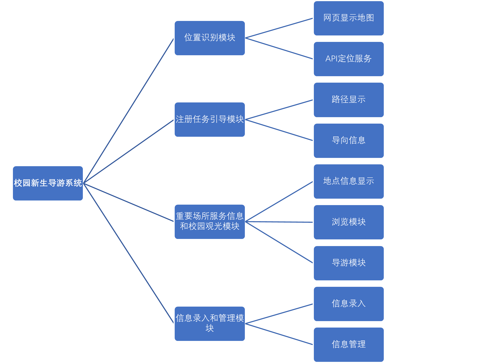

# QTMapApp
C++QT实训，校园导游系统项目。
## 项目背景
每年秋季，高校迎来大量新生，大部分新生对学校不熟悉，对报道流程不清楚。新生往往需要到不同的地点完成报道流程，加上开学人流量大，导致许多新生不知道应该去哪里办理手续，造成不必要的焦虑和困惑，也会导致报到过程的延误和混乱
## 项目目的
校园新生导游系统的最终目的是为高校新生提供一个全面、便捷和个性化的导览体验，帮助他们更好地了解校园环境。具体而言，系统的最终目的包括：
(1)	帮助新生顺利完成注册报道流程。
(2)	提供场所信息和服务介绍。
(3)	为学校提供便捷的信息录入管理功能。
(4)	推动数字化校园建设。
最终目的包含了位置识别、主动导向信息、注册任务导引、重要场所服务信息和校园观光活动等功能。
## 项目结构

